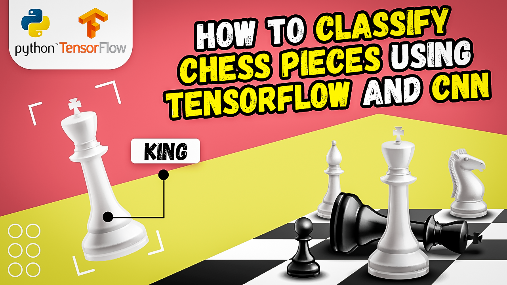

# Building a CNN Model for Chess Piece Recognition in Python and Tensorflow

  

##
   
**Hi there,
I've devoted a lot of time and effort to creating this content.   
If you could show your appreciation by buying me a coffee, I would be truly grateful : https://ko-fi.com/eranfeit**

  

Summary :  

Are you interested in learning about how to use Convolutional Neural Networks in Python to predict chess pieces? 
   
Look no further than this step-by-step tutorial! In this video, we will take you through the process of building and training a convolutional neural network model using TensorFlow and Keras. We will use a dataset of chess piece images to train the model and show you how to evaluate its performance. By the end of this tutorial, you will be able to use the trained model to predict the class of a new chess piece image
   
It is based on Tensorflow and keras.

You can find the link for the [tutorial](https://youtu.be/Y2MkEuZ3AEw) here. 

You can find more cool Tensorflow projects and tutorials in this [playlist](https://youtube.com/playlist?list=PLdkryDe59y4Ze9_12JhWu3cs-lOGYwYeD)

Enjoy

Eran
   

# Recommended courses and relevant products 

If you are interested in learning modern Computer Vision course with deep dive with TensorFlow , Keras and Pytorch , you can find it [here](http://bit.ly/3HeDy1V).

Perfect course for every computer vision enthusiastic

Before we continue , I actually recommend this [book](https://amzn.to/3STWZ2N) for deep learning based on Tensorflow and Keras : 

# Connect

If you have any suggestions about papers, feel free to mail me :)

- [☕ Buy me a coffee](https://ko-fi.com/eranfeit)
- [▶️ Youtube.com/@eranfeit](https://www.youtube.com/channel/UCTiWJJhaH6BviSWKLJUM9sg)
- [🐙 Facebookl](https://www.facebook.com/groups/3080601358933585)
- [🖥️ Email](mailto:feitgemel@gmail.com)
- [🐦 Twitter](https://twitter.com/eran_feit )
- [😸 GitHub](https://github.com/feitgemel)
- [📸 Instagram](https://www.instagram.com/eran_feit/)
- [🤝 Fiverr ](https://www.fiverr.com/s/mB3Pbb)
- [📝 Medium ](https://medium.com/@feitgemel)

