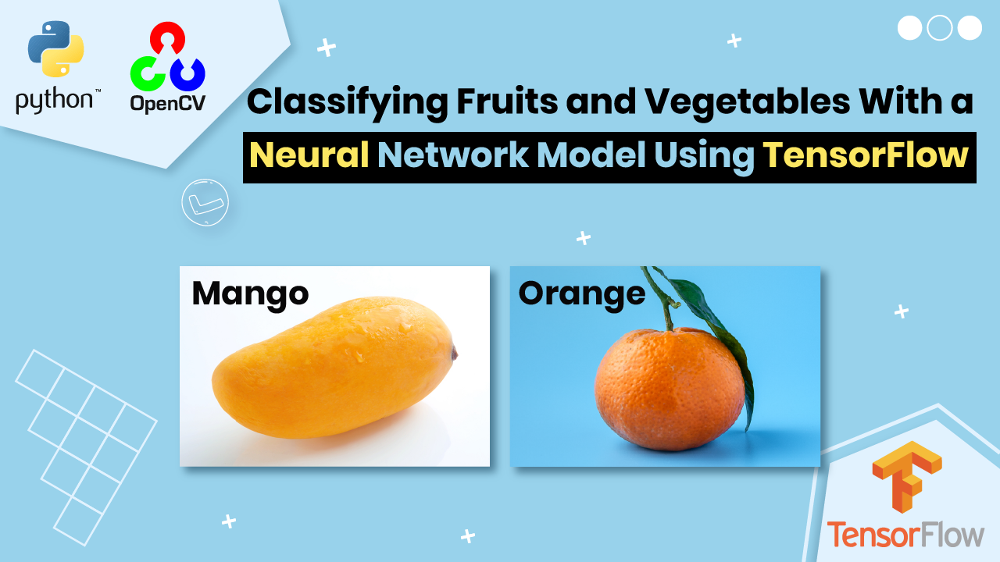

# AI Food Recognition : Classifying 36 Fruits and Vegetables in TensorFlow

  

##
   

Welcome to our 36 Fruits and Vegetables classification tutorial using TensorFlow, Keras and Python  
   

🍏🥕🍅 In this tutorial, we guide you through the process of building a neural network capable of classifying 36 different fruits and vegetables using TensorFlow and Python. 🎥
📚 Here's what you'll learn: 

🔹 Data Preparation: Explore the dataset and learn how to preprocess and organize your image data effectively. 
🔹 Model Building: Construct a deep neural network with TensorFlow and Keras, layer by layer. 
🔹 Model Training: Witness the training process and fine-tuning for impressive accuracy. 
🔹 Model Evaluation: Assess how well the model performs on new, unseen data. 
🔹 Predictions: Discover the inner workings of the model as it makes predictions on individual images.

   

You can find the link for the [tutorial](https://youtu.be/w5T86Z3lod0) here. 

You can find more cool Tensorflow projects and tutorials in this [playlist](https://youtube.com/playlist?list=PLdkryDe59y4Ze9_12JhWu3cs-lOGYwYeD)

Enjoy

Eran
   

# Recommended courses and relevant products 

A perfect course for learning modern Computer Vision with deep dive in TensorFlow , Keras and Pytorch . You can find it [here](http://bit.ly/3HeDy1V).

Perfect course for every computer vision enthusiastic

Before we continue , I actually recommend this [book](https://amzn.to/3STWZ2N) for deep learning based on Tensorflow and Keras. 

# Connect

If you have any suggestions about papers, feel free to mail me :)

- [☕ Buy me a coffee](https://ko-fi.com/eranfeit)
- [▶️ Youtube.com/@eranfeit](https://www.youtube.com/channel/UCTiWJJhaH6BviSWKLJUM9sg)
- [🐙 Facebookl](https://www.facebook.com/groups/3080601358933585)
- [🖥️ Email](mailto:feitgemel@gmail.com)
- [🐦 Twitter](https://twitter.com/eran_feit )
- [😸 GitHub](https://github.com/feitgemel)
- [📸 Instagram](https://www.instagram.com/eran_feit/)
- [🤝 Fiverr ](https://www.fiverr.com/s/mB3Pbb)
- [📝 Medium ](https://medium.com/@feitgemel)

