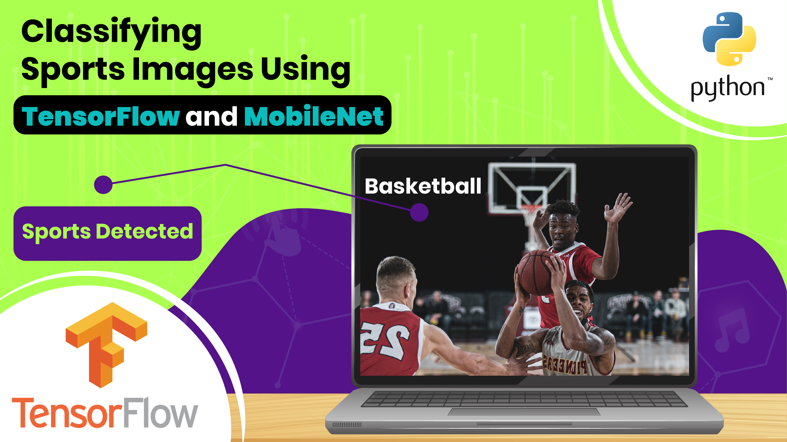

# TensorFlow Sports Image Classification : Building a Custom Model with TensorFlow and Keras 🏆

  

##
   

**Hi there,
I've devoted a lot of time and effort to creating this content.   
If you could show your appreciation by buying me a coffee for just $1, I would be truly grateful : https://ko-fi.com/eranfeit**

  

Summary :  

Welcome to our guide on Sports Image Classification using TensorFlow, Keras, and MobileNet! 🏆📸

   
In this tutorial, You'll learn how to build an image classification model capable of recognizing 21 different sports, from basketball to weightlifting.

🔍 What's Covered in this Video: 🔍

📦 Dataset Download: We'll start by obtaining a large sports image dataset from Kaggle, carefully curated with 21 unique sports categories. 

🏋️‍♂️ Model Building: Using TensorFlow and Keras, we'll dive into the architecture of MobileNet, a pre-trained model. We'll then customize it for our specific classification task. 

🖼️ Data Preparation: Learn how to preprocess and organize your data into train, validation, and test sets, ensuring your model has a solid foundation to learn from. 

🧠 Model Training: We'll guide you through the process of training your model, fine-tuning it to achieve impressive accuracy. 

📊 Model Evaluation: Discover how to assess the performance of your sports image classifier and understand the results. 

📸 Real-World Predictions: Watch as we make predictions on new sports images, overlaying the predicted class for a real-world demonstration of our model in action. 

   

You can find the link for the [tutorial](https://youtu.be/xORACIVRNd4) here. 

You can find more cool Tensorflow projects and tutorials in this [playlist](https://youtube.com/playlist?list=PLdkryDe59y4Ze9_12JhWu3cs-lOGYwYeD)

Enjoy

Eran
   

# Recommended courses and relevant products 

A perfect course for learning modern Computer Vision with deep dive in TensorFlow , Keras and Pytorch . You can find it [here](http://bit.ly/3HeDy1V).

Perfect course for every computer vision enthusiastic

Before we continue , I actually recommend this [book](https://amzn.to/3STWZ2N) for deep learning based on Tensorflow and Keras. 

# Connect

If you have any suggestions about papers, feel free to mail me :)

- [☕ Buy me a coffee](https://ko-fi.com/eranfeit)
- [▶️ Youtube.com/@eranfeit](https://www.youtube.com/channel/UCTiWJJhaH6BviSWKLJUM9sg)
- [🐙 Facebookl](https://www.facebook.com/groups/3080601358933585)
- [🖥️ Email](mailto:feitgemel@gmail.com)
- [🐦 Twitter](https://twitter.com/eran_feit )
- [😸 GitHub](https://github.com/feitgemel)
- [📸 Instagram](https://www.instagram.com/eran_feit/)
- [🤝 Fiverr ](https://www.fiverr.com/s/mB3Pbb)
- [📝 Medium ](https://medium.com/@feitgemel)

