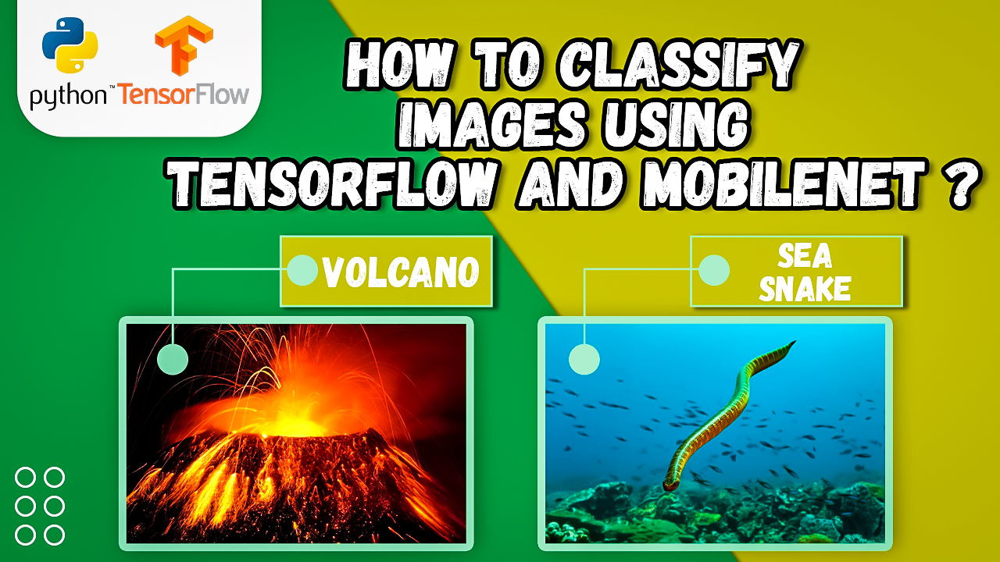

# TensorFlow Transfer Learning: Classify Images with Mobilenet and Python

  

##
   

**Hi there,
I've devoted a lot of time and effort to creating this content.   
If you could show your appreciation by buying me a coffee, I would be truly grateful : https://ko-fi.com/eranfeit**

  

Summary :  

In this tutorial, you'll learn how to use TensorFlow and Mobilenet to classify images through transfer learning. Transfer learning is a technique that allows you to take pre-trained models and adapt them to new use cases, making it an efficient way to build powerful image recognition systems.
   
We'll start by installing the necessary Python libraries, and then walk you through the process of training a Mobilenet model to classify images. You'll learn how to preprocess the image data, fine-tune the model, and evaluate its performance using validation data. By the end of this tutorial, you'll have a solid understanding of how to use TensorFlow and Mobilenet for image classification, and be able to apply these techniques to your own image recognition projects. Whether you're a beginner or an experienced data scientist, this tutorial will give you the tools you need to build sophisticated image recognition systems with ease.
   
It is based on Tensorflow and keras.

You can find the link for the [tutorial](https://eranfeit.net/tensorflow-transfer-learning-classify-images-with-mobilenet-and-python/) here.  
You can find the link for the [Video tutorial](https://youtu.be/xsBm_DTSbB0) here. 

You can find more cool Tensorflow projects and tutorials in this [playlist](https://youtube.com/playlist?list=PLdkryDe59y4Ze9_12JhWu3cs-lOGYwYeD)

Enjoy

Eran
   

# Recommended courses and relevant products 

If you are interested in learning modern Computer Vision course with deep dive with TensorFlow , Keras and Pytorch , you can find it [here](http://bit.ly/3HeDy1V).

Perfect course for every computer vision enthusiastic

Before we continue , I actually recommend this [book](https://amzn.to/3STWZ2N) for deep learning based on Tensorflow and Keras : 

# Connect

If you have any suggestions about papers, feel free to mail me :)

- [▶️ Youtube.com/@eranfeit](youtube.com/@eranfeit?sub_confirmation=1)
- [🌐 My Website](https://eranfeit.net)
- [🐙 Facebookl](https://www.facebook.com/groups/3080601358933585)
- [🖥️ Email](mailto:feitgemel@gmail.com)
- [🐦 Twitter](https://twitter.com/eran_feit )
- [😸 GitHub](https://github.com/feitgemel)
- [📸 Instagram](https://www.instagram.com/eran_feit/)

