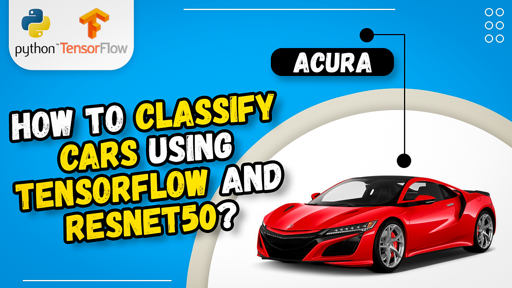

# Resnet50 Tutorial: Classifying Car Images with Transfer Learning and Tensorflow

  

##
   

**Hi there,
I've devoted a lot of time and effort to creating this content.   
If you could show your appreciation by buying me a coffee, I would be truly grateful : https://ko-fi.com/eranfeit**

  

Summary :  

In this video tutorial, you'll discover how to classify car images using computer vision and deep learning.
We'll be using Tensorflow and Keras to configure a Resnet50 model that can quickly and accurately classify car brands with transfer learning.  
   
Whether you're interested in building your own image classification models or want to apply deep learning techniques to a variety of real-world problems, this tutorial is the perfect place to start !

You can find the link for the [tutorial](https://youtu.be/oh7UO4IoAls) here. 

You can find more cool Tensorflow projects and tutorials in this [playlist](https://youtube.com/playlist?list=PLdkryDe59y4Ze9_12JhWu3cs-lOGYwYeD)

Enjoy

Eran
   

# Recommended courses and relevant products 

If you are interested in learning modern Computer Vision course with deep dive with TensorFlow , Keras and Pytorch , you can find it [here](http://bit.ly/3HeDy1V).

Perfect course for every computer vision enthusiastic

Before we continue , I actually recommend this [book](https://amzn.to/3STWZ2N) for deep learning based on Tensorflow and Keras : 

# Connect

If you have any suggestions about papers, feel free to mail me :)

- [▶️ Youtube.com/@eranfeit](youtube.com/@eranfeit?sub_confirmation=1)
- [🐙 Facebookl](https://www.facebook.com/groups/3080601358933585)
- [🖥️ Email](mailto:feitgemel@gmail.com)
- [🐦 Twitter](https://twitter.com/eran_feit )
- [😸 GitHub](https://github.com/feitgemel)
- [📸 Instagram](https://www.instagram.com/eran_feit/)

